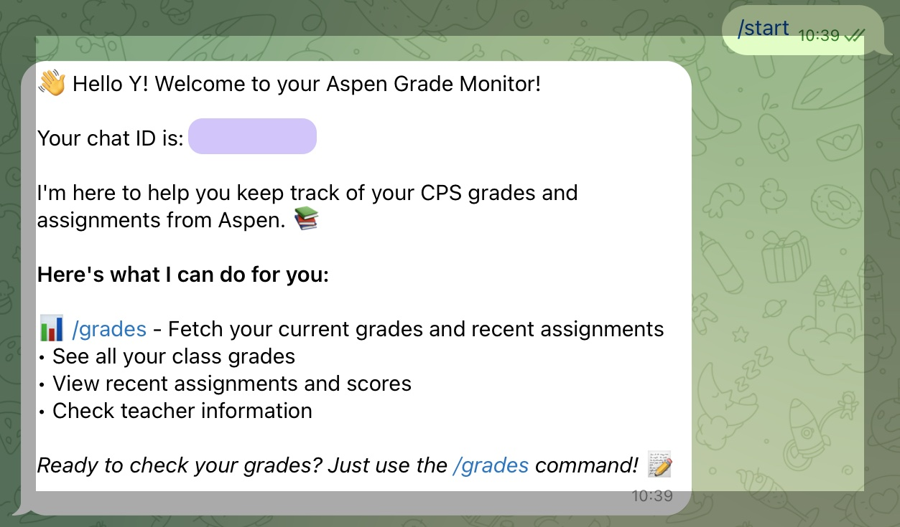

# Aspen Monitor: A Telegram Bot for Grade and Assignment Tracking

This repository hosts a lightweight Telegram bot for quickly checking grades and assignments from [Aspen CPS](https://aspen.cps.edu), the student information system used by **Chicago Public Schools (CPS)**.

### Key Features:
- **Fast grade queries**: Get your grades or assignments instantly via Telegram.
- **Daily updates**: Configure the bot to push daily grade summaries.
- **Minimal setup**: Just add your Aspen credentials and Telegram bot token.

The bot is designed for personal use and requires Aspen credentials. It can be deployed on Railway or Vercel.

## Features
- Real-time grade and assignment updates via Telegram.
- Secure handling of credentials using environment variables.
- Easy deployment on Railway or Vercel.

## Setup Instructions

### Prerequisites
1. Create a Telegram bot and get its token (obtained from [BotFather](https://core.telegram.org/bots#botfather)).
2. Aspen CPS credentials (username and password).

### Deployment

The following process uses Railway as example.

1. Fork this repo and link it to your new project on the deployment platform.

2. Set up environment variables

```env
ENV=prod
ASPEN_USERNAME=your_aspen_username
ASPEN_PASSWORD=your_aspen_password
TELEGRAM_BOT_TOKEN=your_telegram_bot_token
WEBHOOK_URL=https://xxx/api/webhook
```

3. Webhook configuration

After deployment, configure the Telegram webhook to point to your deployed URL, in the terminal of your local computer:

```bash
curl "https://api.telegram.org/bot<your_bot_token>/setWebhook?url=https://your-deployed-url/api/webhook"
```

To check the webhook status:

```bash
curl "https://api.telegram.org/bot<your_bot_token>/getWebhookInfo" | python3 -m json.tool
```

4. Set up Chat IDs

On the Telegram bot, click `/start`, you'll see the following welcome message:



Copy the chat ID, and add the following environment variable:

```
AUTHORIZED_CHAT_IDS=your_chat_id
```

Note that if anthor person is using this bot, the corresponding chat ID needs to be added. The `AUTHORIZED_CHAT_IDS` can be a comma separated list.

Remmember to re-deploy after you have modified the environment variables.


## Support
For issues or feature requests, please open an issue in this repository.
